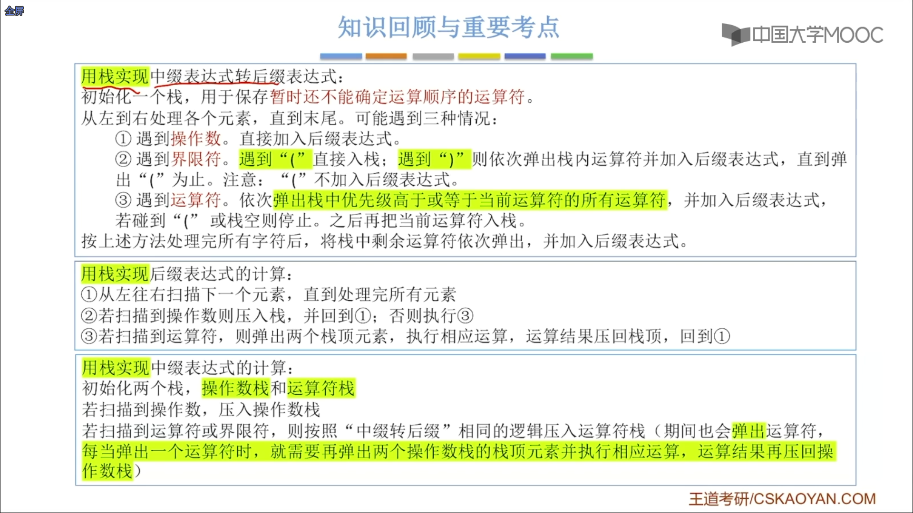

# 栈在表达式中的应用

[TOC]

## 1. 中缀表达式转后缀表达式（机算）

### 原理/步骤

1. 初始化一个栈，用于保存暂时还不能确定运算顺序的运算符。

2. 从左到右处理各个元素，直到末尾。可能遇到三种情况：

   ①遇到操作数。直接加入后缀表达式。

   ②遇到界限符。遇到“(”直接入栈；遇到“)”则依次弹出栈内运算符并加入后缀表达式，直到弹出“（”为止。==注意：“（”不加入后缀表达式==。

   ③遇到运算符。依次弹出栈中优先级==高于==或==等于==当前运算符的所有运算符，并加入后缀表达式，若==碰到“（”或栈空则停止==。之后==再把当前运算符入栈==。

3. 按上述方法处理完所有字符后，将==栈中剩余运算符依次弹出==，并加入后缀表达式。

### for exmaple

1. 
2. 

## 2. 中缀表达式的计算

### 原理/步骤

> 实际上是两个算法的结合：
>
> 中缀转后缀 + 后缀表达式求值

用栈实现中缀表达式的计算：

1. 初始化两个栈，==操作数栈==和==运算符栈==
2. 若扫描到操作数，压入操作数栈
3. 若扫描到运算符或界限符，则按照“中缀转后缀”相同的逻辑压入运算符栈（==期间也会弹出运算符，每当弹出一个运算符时，就需要再弹出两个操作数栈的栈顶元素并执行相应运算，运算结果再压回操作数栈==)

#### 后缀表达式的计算（机算）

用栈实现后缀表达式的计算：

1. 从左往右扫描下一个元素，直到处理完所有元素
2. 若扫描到操作数则压入栈，并回到①：否则执行③
3. 若扫描到运算符，则弹出两个栈顶元素，执行相应运算，运算结果压回栈顶，回到①

> 对于后缀表达式，表达式从左向右入栈，运算时先出栈的是右操作数；
> 对于前缀表达式，表达式从右向左入栈，运算时先出栈的是左操作数；

