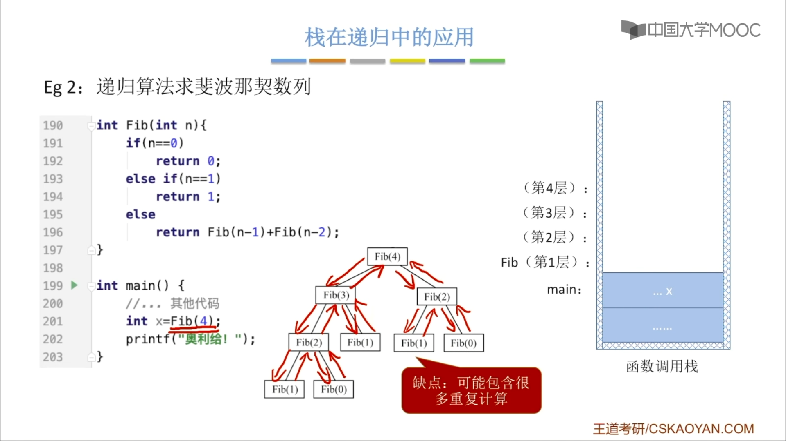

# 栈在递归中的应用

[TOC]

### 1. 函数调用过程

函数调用的特点：最后被调用的函数最先执行结束（LIFO）

函数调用时，需要用一个栈存储：
1. 调用返回地址
2. 实参
3. 局部变量

> 栈中的`.....`代表`main()`之前的一些代码。

### 2. 栈在递归中的应用

适合用“递归”算法解决：可以把原始问题转换为==属性相同==，但==规模较小==的问题。

递归调用时，函数调用栈可称为“递归工作栈”
每进入一层递归，就将递归调用所需信息压入栈顶
每退日一层递归，就从栈顶弹出相应信息

#### 缺点

1. 效率低
2. 太多层递归可能导致栈溢出
   1. 递归空间复杂度高
   2. 可以自定义栈将递归算法改造成非递归算法
3. 可能包含很多重复计算
4. 

