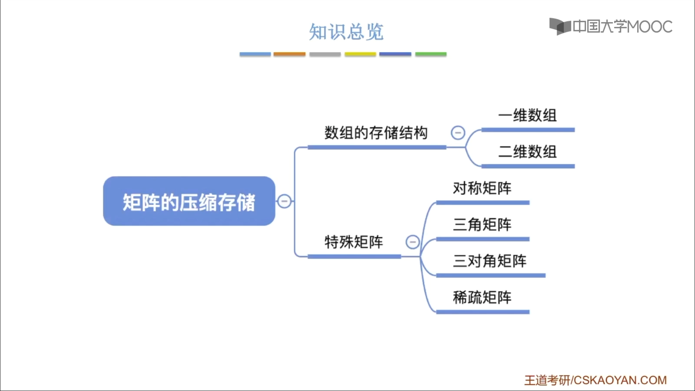
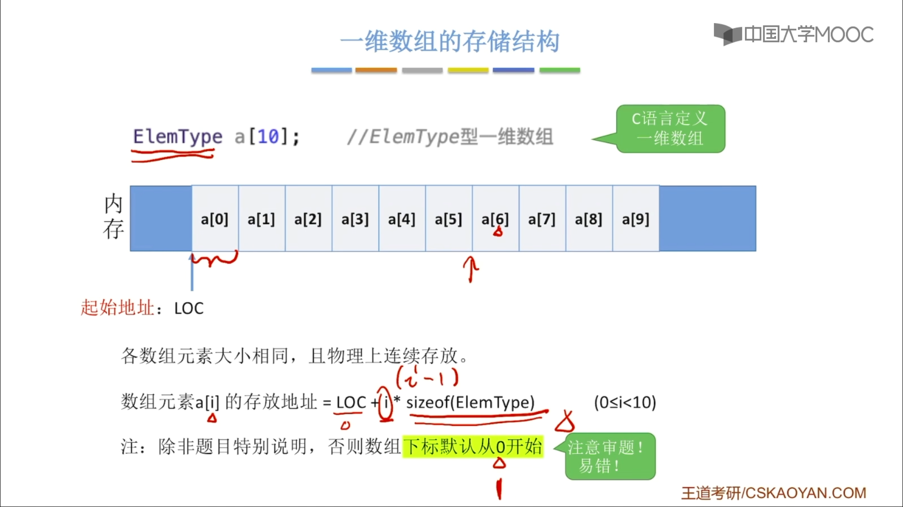
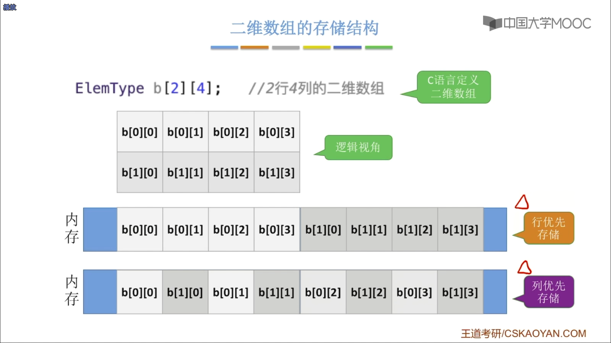
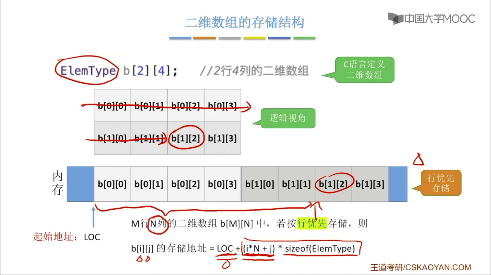
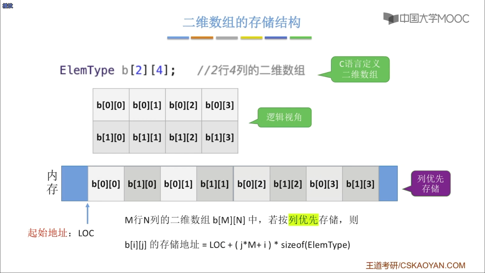
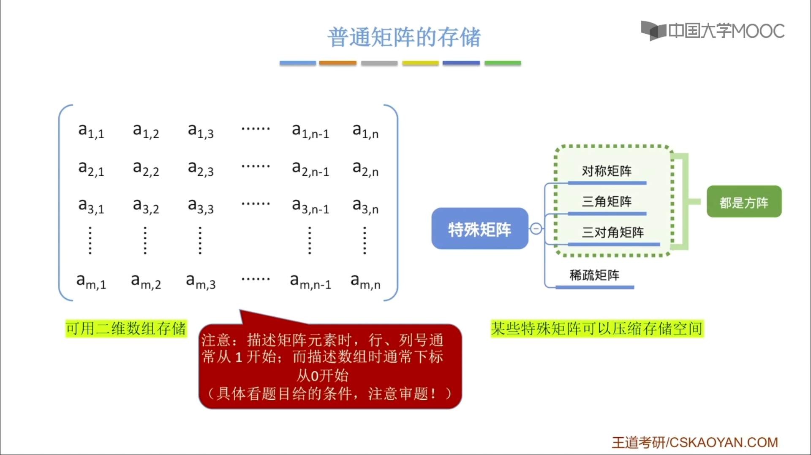
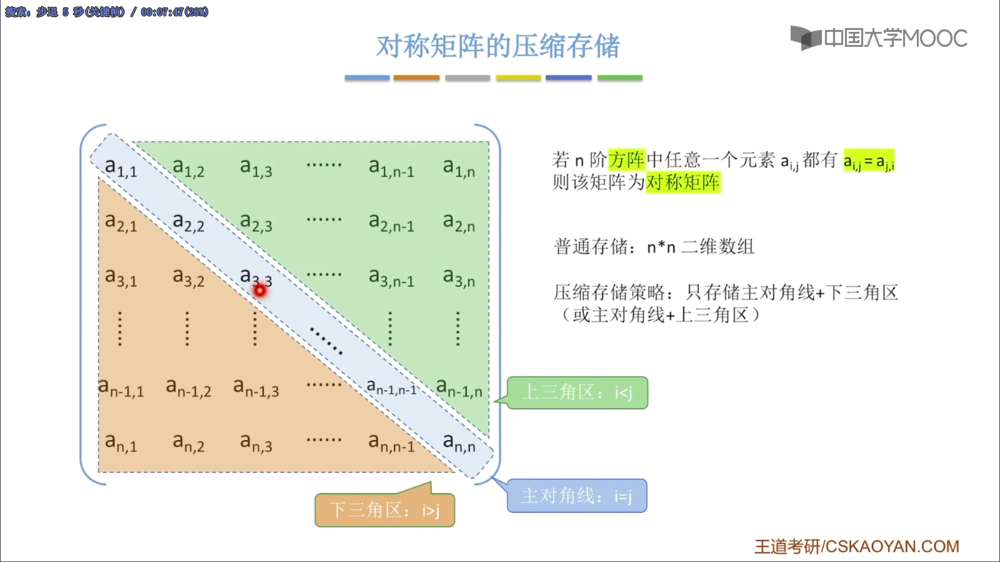
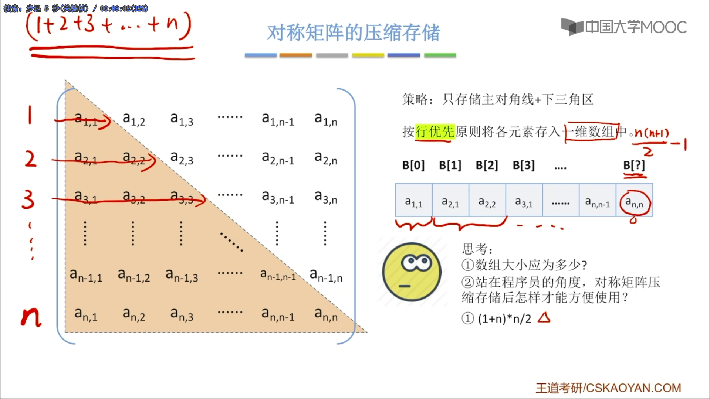

# 矩阵的压缩存储

## 知识总览

[TOC]

### 1. 一维数组的存储结构

> 注意数组下标是==从0还是1开始的==，==默认从0开始==，注意审题

### 2. 二维数组的存储结构

二维数组的存储方式

1. 行优先存储
2. 列优先存储
3. 
4. 行优先的方式计算地址
   1. 
5. 列优先的方式计算地址
   1. 

### 3. 普通矩阵的存储

> 注意矩阵的下标是==从0还是1开始的==，==默认从1开始==，注意审题

可以用`n*n`的二维数组

### 4. 对称矩阵的压缩存储

#### 压缩存储策略

只存储主对角线+下三角区(或主对角线+上三角区)

#### e.g.

1. 只存储主对角线+下三角区

2. 按行优先原则将各元素存入一维数组中

3. 思考

   1. 数组大小应为多少？

      > $1+2+3+\cdots+n=\frac{n(n+1)}{2}$
      >
      > 因此最后一个数组元素的下标是$\frac{n(n+1)}{2}-1$

   2. 站在程序员的角度，对称矩阵压缩存储后怎样才能方便使用？

      > 可以实现一个“映射”函数
      >
      > 矩阵下标——>一维数组下标

